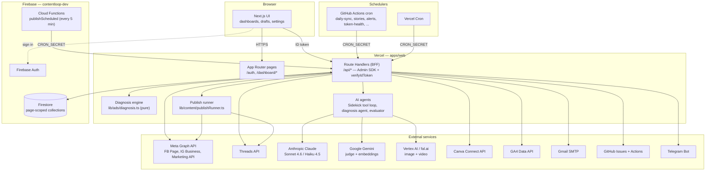
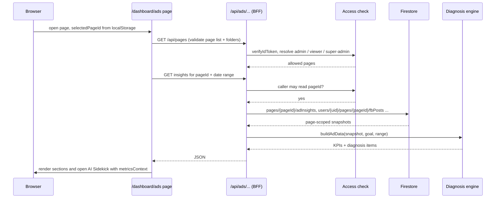
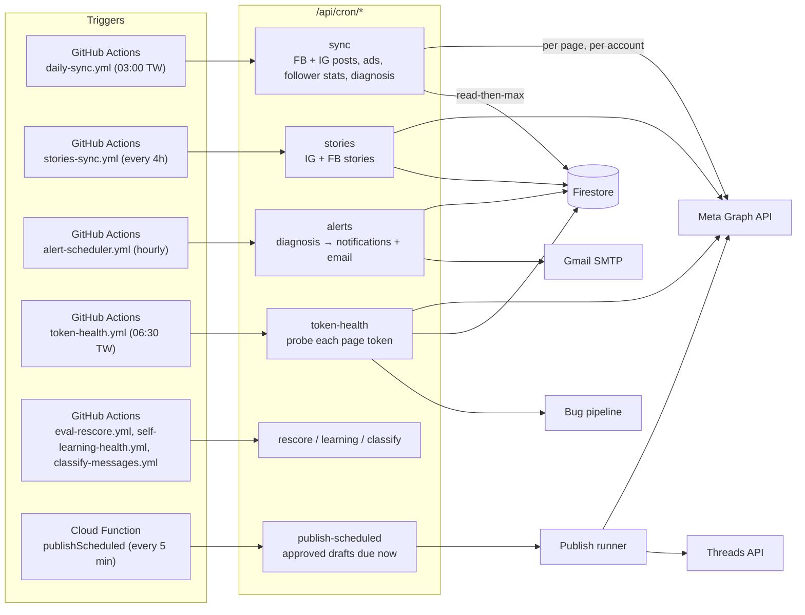
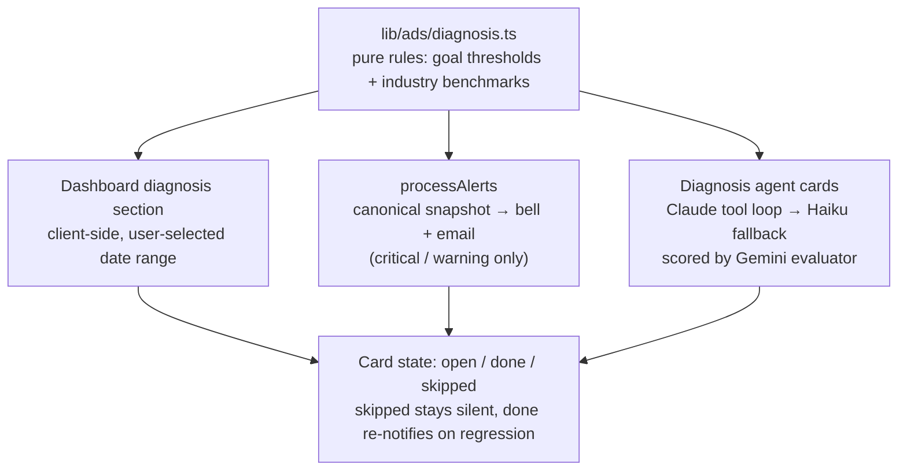
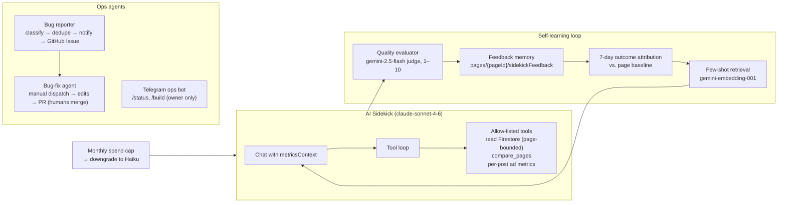
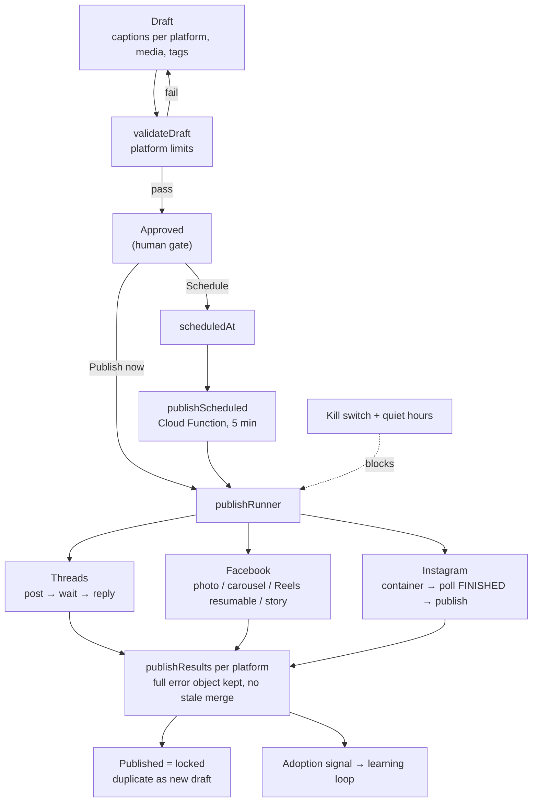
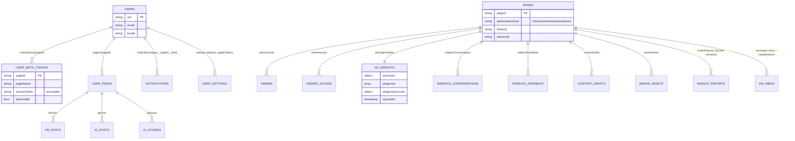
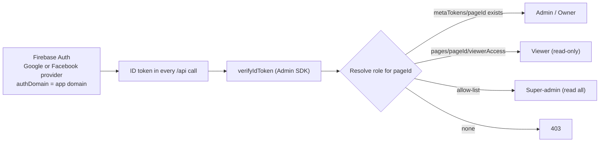
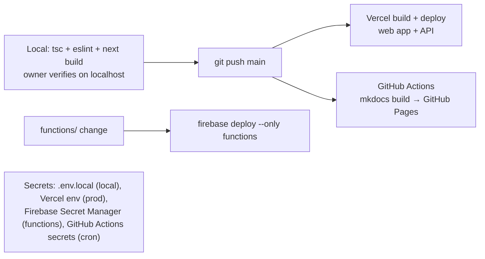

# Architecture

ContentLoop is a monorepo. The web application in `apps/web` is a Next.js 14 App Router project that serves both the UI and a backend-for-frontend (BFF) API layer. Firebase provides Firestore, Auth and a small set of Cloud Functions for scheduling. Vercel hosts the web app; GitHub Actions and Vercel Cron trigger scheduled jobs.

## 1. System overview



### Key rule: the browser never reads Firestore

Firestore security rules block direct client reads. Every read and write goes through `/api/*` route handlers that initialize the Firebase Admin SDK lazily, verify the caller's ID token, and check page access before touching data. This is why the project needs no `firestore.rules` for the dashboard surface.

## 2. Request flow: loading a dashboard



## 3. Data acquisition and scheduled jobs



### Sync guarantees

- **Ad-level, page-filtered snapshots.** Ads are fetched per ad account and kept only when `effective_object_story_id` starts with `${pageId}_`. Stale snapshots from accounts that no longer carry the page's ads are zeroed and self-healed.
- **Read-then-max on engagement.** A transient zero from the API never overwrites a stored true value. New posts with no prior value are written as-is.
- **Pagination in chunks.** Post history is paged through completely; per-post insight calls are chunked to avoid Graph API batch failures.
- **Token errors are explicit.** An `OAuthException` that requires re-authorization marks `tokenValid: false` on the token document and shows a reconnect banner instead of a silent stall.

## 4. Diagnosis engine: one source, three consumers



Stored diagnoses live at `pages/{pageId}/adInsights/latest` and are refreshed by the daily cron, by manual sync, and by the alert cron when the stored copy is older than the last sync.

## 5. AI agent layer



Agents are implemented with the Anthropic SDK directly (tool runner for analysis, Agent SDK for the code-fixing workflow). No LangChain.

## 6. Publishing pipeline



## 7. Firestore data model



### Path conventions

| Path | Scope | Notes |
|---|---|---|
| `users/{uid}/pages/{pageId}/fbPosts`, `igPosts` | Page-scoped | Preferred read path. |
| `users/{uid}/fbPosts`, `igPosts` | Legacy multi-page | Read only as fallback; FB filtered by `${pageId}_` ID prefix; IG never read when `pageId` is known. |
| `pages/{pageId}/...` | Shared per page | Ads, diagnoses, conversations, drafts, admins. Written by the syncing admin, readable by all admins and viewers of that page. |
| `metaWebhookEvents/{mid}` | Top-level | Identifiers only, 30-day TTL. Message bodies go to the page-scoped inbox. |

## 8. Authentication and authorization



Meta OAuth is a separate step after Firebase sign-in. It discovers every page the connecting user manages and stores one page token per page under that user. The first connector of a page is recorded as its owner.

## 9. Repository layout

```text
TM-contentloop/
├─ apps/web/                 # Next.js app: UI + BFF API (main codebase)
│  ├─ app/                   # App Router pages and /api route handlers
│  ├─ components/            # React components (ads/, content/, analytics/ ...)
│  ├─ lib/                   # Pure logic: ads/diagnosis, sidekick/, meta/, publish/, ai/
│  └─ next.config.mjs        # includes /__/auth/* rewrite for same-origin auth
├─ functions/                # Firebase Cloud Functions (publishScheduled)
├─ .github/workflows/        # Cron triggers, bug-fix agent, docs deploy
├─ docs/                     # Planning documents (single source of truth per phase)
├─ site-docs/                # This documentation site (MkDocs)
├─ CLAUDE.md / AGENTS.md     # Project rules for AI collaborators
└─ README.md                 # Project summary + detailed change log
```

## 10. Deployment


