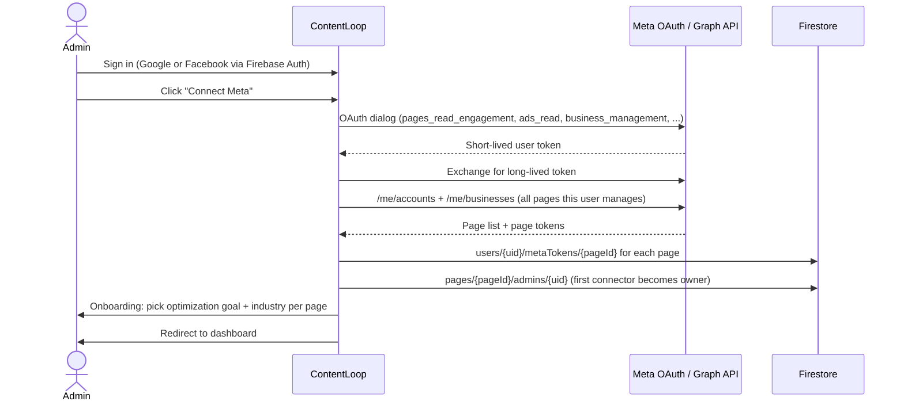
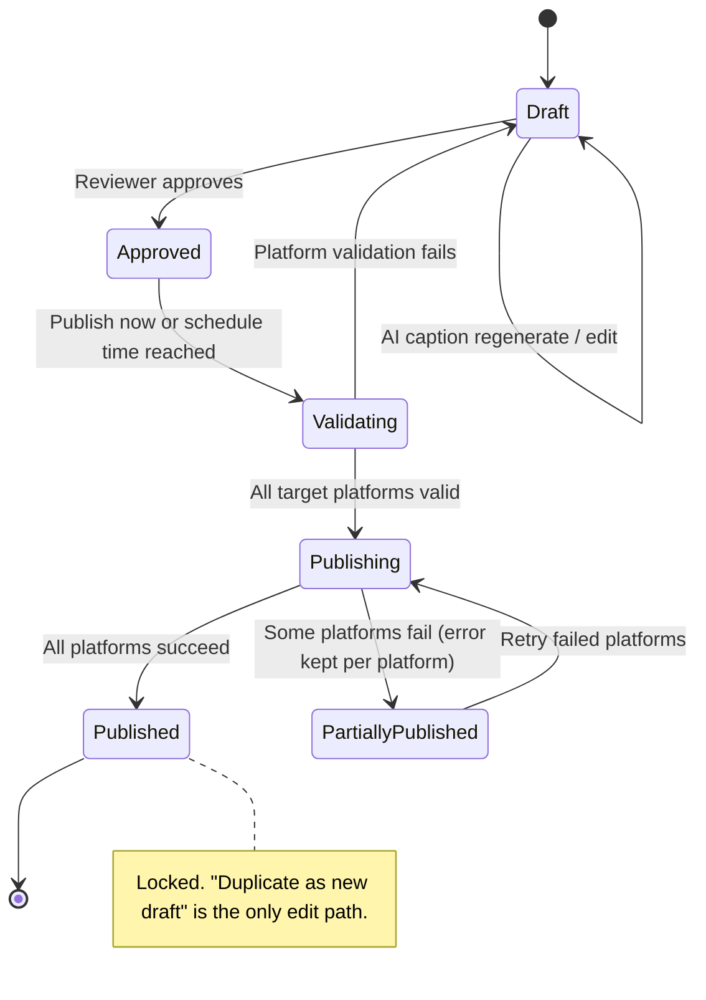

# Product Requirements Document

## 1. Overview

**ContentLoop** is a web application that helps administrators of Facebook Pages (and their linked Instagram Business and Threads accounts) understand how their organic content and paid ads perform, receive AI-generated diagnoses and recommendations, and act on them through an approval-gated content workflow.

The first customer is a Toastmasters district and its clubs. The product is designed from day one for **many pages managed by many admins**, including a single admin who manages several unrelated pages at once.

### 1.1 Problem statement

Page admins in volunteer organizations and small brands:

- Check Meta Business Suite sporadically and miss slow declines in reach or rising ad costs.
- Do not know which metric matters for their campaign goal (clicks vs. conversions vs. reach vs. event sign-ups).
- Have no benchmark to tell "bad" from "normal".
- Spend hours writing captions and building creatives without feedback on what actually worked.
- Cannot delegate reporting to non-admin volunteers without handing over page access.

### 1.2 Goals

| # | Goal | Success signal |
|---|---|---|
| G1 | Give every admin a daily-fresh view of post, story and ad performance for **each page separately**. | Daily sync succeeds; dashboards load with page-scoped data only. |
| G2 | Turn raw metrics into **prioritized, actionable diagnoses** tied to the page's stated goal. | Diagnosis cards with `critical` / `warning` / `good` status per rule; alerts sent only for the first two. |
| G3 | Provide an **AI assistant** that reasons over the page's real numbers and learns from feedback. | Sidekick answers cite live metrics; evaluator scores trend upward; validated copy re-enters few-shot memory. |
| G4 | Let admins **draft, review and publish** content without leaving the tool, with a human approval gate. | Drafts move through `draft → approved → published` with validation and audit log. |
| G5 | Keep viewers, admins, owners and super-admins **strictly isolated per page**. | Cross-page isolation test passes before every release. |

### 1.3 Non-goals (current scope)

- Writing to Meta ad objects (budget, status, targeting). Planned for Phase 4 behind `ads_management` App Review.
- Replying to direct messages automatically in production. Phase 5-2 runs in dry-run until a separate App Review.
- Replacing Meta Business Suite for day-to-day community management.

## 2. Users and roles

| Role | Who | Can do |
|---|---|---|
| **Owner** | First admin to connect a page via Meta OAuth | Everything for that page: sync, settings, invite viewers, export Sidekick history. |
| **Admin** | Any Facebook admin of the page who connects with their own account | Same as owner minus ownership transfer. Each admin's page token is stored separately. |
| **Viewer** | Invited by an admin, no Meta connection needed | Read-only dashboards and reports for the pages they were granted. |
| **Super-admin** | Operator allow-list | Read-level access to all pages for support, plus the AI bug report page and ops bot commands. |

!!! warning "Isolation applies to every role"
    A single person may be admin of several pages. When a request carries a `pageId`, **every** read of posts, insights, ads or conversations must be bounded by that page. Super-admins are not exempt. See [Invariants](#6-invariants-and-constraints).

## 3. User journeys

### 3.1 First connection

The connection flow is **user-centric**: it discovers the pages the connecting user manages. A configured page identifier may be merged in as a fallback, but it is never the primary source and never leaks into error messages shown to other users.

### 3.2 Daily monitoring

1. Scheduled jobs sync posts, stories and ads for every connected page, recompute diagnoses and refresh follower stats.
2. The diagnosis engine produces per-page findings; only `critical` and `warning` create an in-app notification and, on the page's schedule, an email digest.
3. The admin opens the dashboard, sees the notification bell count, and deep-links into the diagnosis section.
4. Token health runs daily. An expired token flips a banner that tells the token owner to reconnect, and tells everyone else which admin to notify.

### 3.3 Optimize with AI

1. Admin opens the AI Sidekick on any dashboard. Current page, date range and metrics are injected as context.
2. Sidekick may call tools to read Firestore, compare pages the user is allowed to see, or fetch per-post ad metrics.
3. Admin asks for captions or creatives. The Sidekick drafts platform-specific copy, or generates images with optional brand-logo overlay.
4. Adoption (publishing an AI caption, downloading a creative, marking a diagnosis card done) is recorded as a learning signal. Seven days later, the effect is measured against the page's baseline and validated examples are promoted to few-shot memory.

### 3.4 Publish content

Global controls: a **kill switch** that halts all scheduled publishing, and **quiet hours** during which nothing is posted.

## 4. Functional requirements

### 4.1 Data acquisition

| ID | Requirement |
|---|---|
| FR-1.1 | Sync Facebook Page posts with reactions, comments, shares, reach and views, paginating through history. |
| FR-1.2 | Sync Instagram Business media and stories; stories are polled every ~4 hours because they expire after 24 hours. |
| FR-1.3 | Sync Threads posts and follower count via the separate Threads OAuth token. |
| FR-1.4 | Sync Meta ad insights per ad, selecting the ad account that actually contains this page's creatives, and filtering by `effective_object_story_id` page prefix. |
| FR-1.5 | Sync device, platform, age and gender breakdowns for ads. |
| FR-1.6 | Manual "Sync latest data" must never wipe a stored true value with a transient zero (read-then-max on engagement). |
| FR-1.7 | Optional GA4 property connection for e-commerce customers running Google Ads. |
| FR-1.8 | Optional CSV / Markdown import of Business Suite exports for pages without API history. |

### 4.2 Dashboards

| ID | Requirement |
|---|---|
| FR-2.1 | Content dashboard: KPI strip, trend chart, three-platform follower counts, paginated post tables with type filters and search. |
| FR-2.2 | Ads dashboard: overview KPIs ordered by the page's optimization goal, diagnosis cards, creative ranking, creative trends with A/B comparison, budget simulator, audience demographics, device distribution, hourly ROAS heatmap. |
| FR-2.3 | Cross-page compare view for admins with access to multiple pages. |
| FR-2.4 | Messaging analytics: DM volume, response performance, peak hours, AI intent classification. |
| FR-2.5 | Page switcher with per-user folders; selection persisted in local storage and re-validated server-side. |
| FR-2.6 | Full Chinese / English UI toggle. |

### 4.3 Diagnosis engine

| ID | Requirement |
|---|---|
| FR-3.1 | Rules live in exactly one pure-function module shared by server and client. |
| FR-3.2 | Thresholds depend on the page's optimization goal (`clicks`, `conversion`, `reach`, `event`) and industry benchmarks. |
| FR-3.3 | Each finding has a status (`critical`, `warning`, `good`), a headline, evidence and a recommended action. |
| FR-3.4 | Findings can be marked done or skipped. Skipped findings stay silent; completed findings re-notify only if they regress. |
| FR-3.5 | An agent layer rewrites findings into concise recommendation cards (Claude tool loop with Haiku fallback), scored by a quality evaluator. |

### 4.4 AI Sidekick and self-learning

| ID | Requirement |
|---|---|
| FR-4.1 | Conversations are stored per page and exportable by the owner. |
| FR-4.2 | Tool access is allow-listed and bounded to pages the caller can see. |
| FR-4.3 | Quality evaluator (Gemini judge, 1–10 rubric) scores generated cards and copy; daily batch re-scores. |
| FR-4.4 | Adoption signals plus 7-day outcome attribution decide which examples enter few-shot memory. |
| FR-4.5 | Monthly Anthropic spend cap; when exceeded, the diagnosis agent downgrades to Haiku. |

### 4.5 Reports and notifications

| ID | Requirement |
|---|---|
| FR-5.1 | Insight report per period (week, month, quarter, year) with industry benchmark comparison, best / worst posts, ad A/B, next steps. |
| FR-5.2 | Report narrative is cached in Firestore and invalidated by a data fingerprint; metrics are always recomputed. |
| FR-5.3 | Per-user notification center with unread count and idempotent per-day notification IDs. |
| FR-5.4 | Email digest on a per-page weekday / hour schedule via Gmail SMTP. |
| FR-5.5 | Daily Meta token health check; three or more simultaneous failures escalate to "suspected app-level issue". |

### 4.6 Content creation and publishing

| ID | Requirement |
|---|---|
| FR-6.1 | Drafts with per-platform AI captions, hashtags, tags, multi-image carousels (up to 10), video and story variants. |
| FR-6.2 | High-fidelity preview per platform and device. |
| FR-6.3 | Validation of platform limits (character counts, media dimensions, ratios) before approval. |
| FR-6.4 | Publish or schedule (5-minute granularity) to Threads, Facebook and Instagram; Reels use resumable upload. |
| FR-6.5 | Publish results keep the full platform error object per platform; retries never resurrect stale errors. |
| FR-6.6 | Brand asset library per page with automatic logo overlay on generated images, and one-click hand-off to Canva. |
| FR-6.7 | Royalty-free background music library per page for video creatives. |

### 4.7 Operations and agents

| ID | Requirement |
|---|---|
| FR-7.1 | Bug report pipeline: runtime anomalies are classified, deduplicated, surfaced to super-admins and opened as GitHub Issues. |
| FR-7.2 | Bug-fix agent runs only on manual dispatch, edits files only, opens a PR; humans merge. |
| FR-7.3 | Telegram ops bot for status and build commands, owner-gated. |
| FR-7.4 | Anthropic usage is recorded per call and shown on a cost page. |

## 5. Non-functional requirements

| Area | Requirement |
|---|---|
| Security | All data access goes through the BFF using the Firebase Admin SDK and ID-token verification. The browser never reads Firestore directly. Secrets are never committed. |
| Privacy | Webhook event records store only identifiers with a 30-day TTL; message bodies are written only into page-scoped inboxes. |
| Reliability | Scheduled jobs are idempotent. Long-running syncs paginate in chunks to avoid Graph API batch failures. Webhook processing uses a state machine with leases so retries neither duplicate nor drop messages. |
| Performance | Post queries are date-range bounded (max 1000 rows) and paginated client-side. Background sync is throttled to once per 3 hours per page with a Firestore lock. |
| Quality gate | `tsc`, `eslint` and `next build` must pass before any commit. Pure functions covering isolation prefixes, publish validation and diagnosis thresholds are unit-tested with Vitest. |
| Deploy | Push to `main` deploys the web app on Vercel; `functions/` changes deploy via Firebase CLI. Changes are verified on localhost by the owner before push. |

## 6. Invariants and constraints

!!! danger "Page isolation is the highest-order invariant"
    - When `pageId` is known, read only `users/{uid}/pages/{pageId}/...` or `pages/{pageId}/...`.
    - Legacy multi-page collections may be read as a fallback only with a `${pageId}_` document-ID filter (Facebook). Instagram legacy data has no prefix and must not be read when `pageId` is known.
    - Ad-to-post matching uses the `${pageId}_` prefix of `effective_object_story_id`, never the bare post ID.
    - Every API route that receives `pageId` verifies the caller's access before returning data.
    - Release acceptance: an account that manages pages A and B sees nothing of B while viewing A, and vice versa.

!!! info "Diagnosis rules have one home"
    Threshold or copy changes are made in the single diagnosis module. The dashboard, the notification bell and the alert email all pick up the change without further edits.

!!! note "Meta platform constraints"
    - Development-mode apps: content published through the API to Facebook is visible only to app roles. A `NEXT_PUBLIC_META_APP_LIVE` flag switches Facebook publishing between preview and live behavior.
    - `business_management`, messaging scopes and publishing scopes require App Review and, for some, Business Verification.
    - Facebook Event creation is not available through the Graph API; the product offers promotion kits instead.
    - Facebook reach metrics moved to the `views` family in June 2026; the app reads the new metric names.

## 7. Roadmap

| Phase | Scope | Status |
|---|---|---|
| 1 | OAuth, sync, dashboards | Live |
| 2 | Notification center + email alerts | Live |
| 3 | Sidekick optimization loop + self-learning | Live |
| 3B | Agent tooling, cross-page compare, bug pipeline and fix agent | Delivered |
| 3C | ChatOps (Telegram) | Delivered |
| 4 | Semi-automated ad updates (Meta Marketing API write) | Planned, needs `ads_management` review |
| 5-1 | Messaging analytics (read-only) | Live |
| 5-2 | FAQ auto-reply chatbot | Dry-run; needs separate App Review |
| Ext. | LinkedIn as fourth platform (Community Management API) | Planned, gated on LinkedIn approval |

Detailed planning documents for each phase live in the repository under `docs/`.
